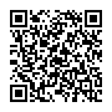

# Zappar for A-Frame
## Webpack Bootstrap Project

In this project you'll find an Node.js project that gets you up and running with Zappar for A-Frame.

Head to the NPM package page for more information on how to build best-in-class AR experiences: [Zappar for A-Frame](https://www.npmjs.com/package/@zappar/zappar-aframe) (@zappar/zappar-aframe)

## Preview
Scan the QR code below using your native camera app or QR code reader to view the example:
​


The project has been set up to use webpack for bundling assets and code. To get started, install the project's dependencies by running the following command:
```
npm install
```

During development, you can use the following command to run a `webpack-dev-server` for testing on your computer or a device on your local network:
```
npm run dev-server
```

And when you're ready to publish your site, run the following command. The resulting `dist` folder can be uploaded to ZapWorks for publishing. If you'd like to self-host your site, be sure to check out the documentation on the [Zappar for A-Frame](https://www.npmjs.com/package/@zappar/zappar-aframe) page.
```
npm run build
```
